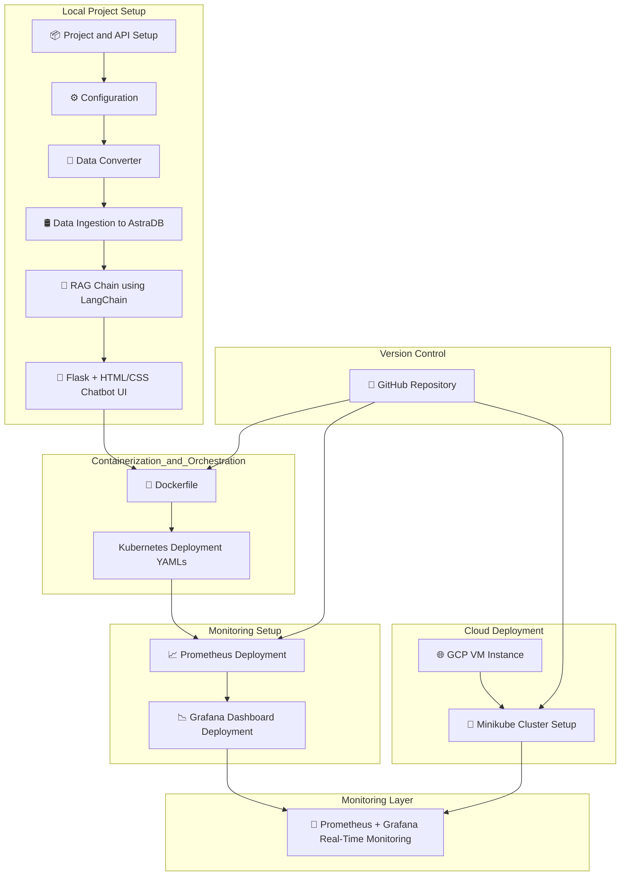
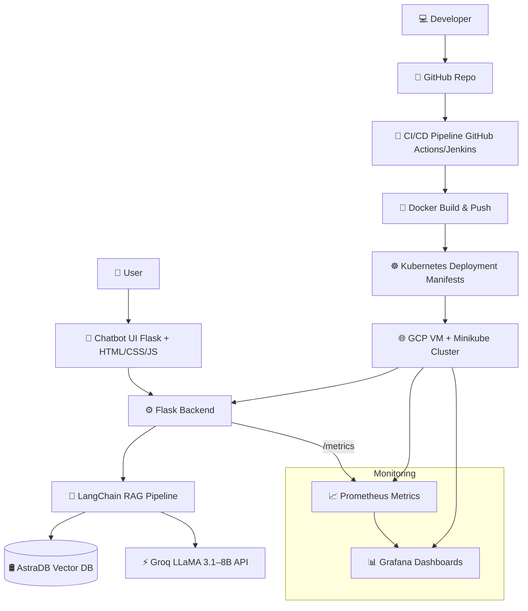

<p align="center">
  
  
  
  
  
  
  
  
  
  
  
  
</p>

<h2 align="center">🤖 NexPick : Your Smart Shopping Assistant</h2>

<p align="center">
  NexPick is a real-time AI chatbot that recommends Flipkart products using natural language. <br>
  It combines <strong>LangChain</strong>, <strong>Groq LLaMA 3.1–8B</strong>, and <strong>AstraDB</strong> in a RAG pipeline, <br>
  with full deployment on <strong>GCP Kubernetes</strong>, monitored via <strong>Prometheus + Grafana</strong>.
</p>

---

## 📚 Table of Contents

- [🎯 Features](#-features)
- [🧱 Project Architecture](#-project-architecture)
- [🧪 Project WorkFlow](#-Project-WorkFlow)
- [✅ Step-by-Step: How NexPick Works](#-step-by-step-how-NexPick-works)
- [🧪 Inputs & Functionality](#-inputs--functionality)
- [🛠️ Tech Stack](#-tech-stack)
- [📦 Folder Structure](#-folder-structure)
- [🚀 How to Run Locally](#-how-to-run-locally)
- [✅ Docker Run (Optional)](#-docker-run-optional)
- [🛠️ CI/CD and Deployment Setup Instructions](#-cicd-and-deployment-setup-instructions)
- [📸 UI Preview](#-ui-preview)
- [📊 Monitoring Dashboard](#-monitoring-dashboard)
  - [🔎 Prometheus](#-prometheus)
  - [📈 Grafana](#-grafana)
- [🤝 Contributors](#-contributors)

--- 

## 🎯 Features

NexPick combines intelligent product search with real-time observability and scalable deployment. Key features include:

- 🤖 **LLM-Powered Product Recommender**  
  Built using Groq’s **Llama-3.1-8B** model and LangChain’s **RAG** architecture for contextual, human-like shopping assistance.

- 🧠 **Retrieval-Augmented Generation (RAG)**  
  Smart product lookup powered by AstraDB and LangChain retriever modules.

- 💬 **Chatbot Interface with HTML/CSS + Flask**  
  Clean, responsive frontend to interact with the AI assistant—similar to Flipkart’s real-time recommendation bot.

- 🐳 **Dockerized App**  
  Easily containerized using a single Dockerfile to simplify deployments across environments.

- ☸️ **Kubernetes Deployment (Minikube + GCP)**  
  Modular YAML-based deployment on a GCP VM with Minikube for full orchestration support.

- 📊 **Real-Time Monitoring (Prometheus + Grafana)**  
  Live application insights and health metrics using open-source observability tools.

- 🔐 **Config-Driven Architecture**  
  Uses `.env` and Python-based configuration management for easy tuning and environment flexibility.

- 🌐 **Cloud-Native Design**  
  Runs fully on cloud VM infrastructure and AstraDB, ensuring scalability, uptime, and resilience.

--- 

## 🧱 Project Architecture

```mermaid
graph TD

subgraph Local Project Setup
    A1[📦 Project and API Setup] --> A2[⚙️ Configuration ]
    A2 --> A3[🔁 Data Converter ]
    A3 --> A4[🛢️ Data Ingestion to AstraDB]
    A4 --> A5[🧠 RAG Chain using LangChain]
    A5 --> A6[💬 Flask + HTML/CSS Chatbot UI]
end

subgraph Containerization_and_Orchestration
    B1[🐳 Dockerfile] --> B2[Kubernetes Deployment YAMLs]
end

subgraph  Monitoring Setup
    C1[📈 Prometheus Deployment] --> C2[📉 Grafana Dashboard Deployment]
end

subgraph  Version Control
    D1[🔗 GitHub Repository]
end

subgraph  Cloud Deployment
    E1[🌐 GCP VM Instance] --> E2[🔧 Minikube Cluster Setup]
end

subgraph  Monitoring Layer
    F1[📡 Prometheus + Grafana Real-Time Monitoring]
end

A6 --> B1
B2 --> C1
C2 --> F1
D1 --> B1
D1 --> C1
D1 --> E2
E2 --> F1
```
---

## 🧪 Project WorkFlow

```mermaid

graph TD

%% ================= User Interaction =================
User[👤 User] --> UI[💬 Chatbot UI Flask + HTML/CSS/JS]
UI --> Backend[⚙️ Flask Backend]

%% ================= Core App Flow =================
Backend --> LangChain[🧠 LangChain RAG Pipeline]
LangChain --> AstraDB[(🛢️ AstraDB Vector DB)]
LangChain --> LLM[⚡ Groq LLaMA 3.1–8B API]

%% ================= CI/CD Pipeline =================
Dev[💻 Developer] --> GitHub[🔗 GitHub Repo]
GitHub --> CI[🚀 CI/CD Pipeline GitHub Actions/Jenkins]
CI --> Docker[🐳 Docker Build & Push]
Docker --> K8sDeploy[☸️ Kubernetes Deployment Manifests]
K8sDeploy --> GCP[🌐 GCP VM + Minikube Cluster]

%% ================= Monitoring =================
subgraph Monitoring
    Prometheus[📈 Prometheus Metrics]
    Grafana[📊 Grafana Dashboards]
end

Backend -->|/metrics| Prometheus
Prometheus --> Grafana

%% ================= Cluster Connections =================
GCP --> Backend
GCP --> Prometheus
GCP --> Grafana

```

## ✅ Step-by-Step: How NexPick Works

### 1. 👤 User Interaction
- Users interact with a **chatbot UI** built using **Flask + HTML/CSS/JS**.  
- They can ask queries in natural language, e.g.,  
  *“Best phone under ₹15k”*.

### 2. ⚙️ Backend Request Handling
- The **Flask backend** receives the query.  
- It forwards the query to the **LangChain-based RAG pipeline** for intelligent retrieval and response generation.

### 3. 🧠 Retrieval-Augmented Generation (RAG)
- **LangChain** converts the query into embeddings.  
- **AstraDB (Vector Store)** retrieves the most relevant product documents.  
- Retrieved context + query → sent to **Groq-hosted LLaMA 3.1–8B model**.  
- The model generates **ultra-fast, grounded answers**.

### 4. 💬 Chatbot Response
- Backend formats the response with **product names, specs, and recommendations**.  
- The chatbot UI displays results in a **conversational flow**.

### 5. 🐳 Containerization
- Entire application (**backend + frontend + RAG logic**) is **containerized with Docker**.  
- Ensures a **consistent runtime environment** across dev, test, and prod.

### 6. ☸️ Kubernetes Orchestration & Cloud Deployment
- **Kubernetes manifests** define how:
  - Flask app  
  - Prometheus  
  - Grafana  
  run inside the cluster.  
- Deployed to a **Minikube cluster on a GCP VM**, making it **scalable and cloud-ready**.

### 7. 📈 Monitoring & Observability
- Flask backend exposes **/metrics** endpoint.  
- **Prometheus** scrapes metrics (request count, latency, error rate).  
- **Grafana dashboards** provide **real-time system health monitoring**.

### 8. 🔄 CI/CD Workflow
- Source code maintained in **GitHub**.  
- **GitHub Actions / Jenkins pipelines**:
  - Build Docker images  
  - Apply Kubernetes manifests  
- Enables **repeatable deployments** and **smooth version control**.

## 🛠️ Tech Stack

| Category                            | Technology                      | Description                                                 |
| ----------------------------------- | ------------------------------- | ----------------------------------------------------------- |
| ⚙️ Core Components                  | **Groq API (LLaMA 3.1 - 8B)**   | Fast LLM inference for generating product suggestions       |
|                                     | **LangChain**                   | Handles the Retrieval-Augmented Generation (RAG) pipeline   |
|                                     | **Flask**                       | Backend framework for API and chatbot interactions          |
|                                     | **AstraDB (Vector Store)**      | Stores product embeddings for semantic similarity search    |
| 🧰 Frontend                         | **HTML / CSS / JavaScript**     | Custom-built UI for chatbot interaction                     |
| 🐳 Containerization & Orchestration | **Docker**                      | Containerizes the entire application                        |
|                                     | **Kubernetes (Minikube)**       | Manages application services and scaling via pods           |
| 📈 Monitoring                       | **Prometheus**                  | Scrapes real-time app metrics (like latency, HTTP requests) |
|                                     | **Grafana**                     | Visualizes metrics and builds real-time dashboards          |
| ☁️ Cloud Infrastructure             | **Google Cloud Platform (GCP)** | Hosts the Kubernetes cluster and VM environment             |
| 🔄 CI/CD and DevOps                 | **GitHub**                      | Version control, collaboration, and deployment tracking     |

---

## 📦 Folder Structure
```bash
├── app.py # Flask application entry point
├── Dockerfile # Container instructions
├── flask-deployment.yaml # Kubernetes deployment file for Flask app
├── requirements.txt # Python dependencies
├── setup.py # Project setup script
├── structure.txt # Folder structure reference

├── data/
│ └── flipkart_product_review.csv # Raw product review dataset

├── grafana/
│ └── grafana-deployment.yaml # Grafana deployment configuration

├── prometheus/
│ ├── prometheus-configmap.yaml # Prometheus scraping configuration
│ └── prometheus-deployment.yaml # Prometheus deployment configuration

├── rag_pipeline/
│ ├── config.py # Configuration variables and constants
│ ├── data_converter.py # Script to clean/convert raw data
│ ├── data_ingestion.py # Load data into AstraDB vector store
│ └── rag_chain.py # LangChain RAG pipeline using Groq LLM

├── static/
│ └── style.css # Frontend styles for chatbot UI

├── templates/
│ └── index.html # Chatbot frontend layout (HTML)

├── utils/
│ ├── custom_exception.py # Custom exception handler
│ └── logger.py # Logging utility

└── venv/ # Virtual environment (excluded in Git)
```
---

## 🚀 How to Run Locally
Follow these steps to set up and run **NexPick** locally:

### 1. Clone the Repository

```bash
git clone https://github.com/aimldinesh/NexPick.git
cd NexPick
```
### 2. Create and Activate Virtual Environment
```bash
python -m venv venv
source venv/bin/activate  # On Windows: venv\Scripts\activate
```
### 3. Install Dependencies
```bash
pip install -e . # or pip install -r requirements.txt
```
### 4. Set Environment Variables
Create a .env file in the root directory and add your secrets like:
```bash
GROQ_API_KEY = " " 
HF_TOKEN = " "
HUGGINGFACEHUB_API_TOKEN = " "
ASTRA_DB_API_ENDPOINT = " "
ASTRA_DB_APPLICATION_TOKEN = " "
ASTRA_DB_KEY_SPACE = "default_keyspace"
```
### 5. Run the App
```bash
python appp.py
```
The app will be available at: http://127.0.0.1:5000

---
## ✅ Docker Run (Optional)
```bash
docker build -t nexpick-app .
docker run -p 5000:5000 nexpick-app
```
---
## 🛠️ CI/CD and Deployment Setup Instructions

For detailed, end-to-end deployment steps—including Docker build, Kubernetes deployment on GCP, and Prometheus & Grafana monitoring setup:

👉 [View Full Setup Instructions →](./complete_setup.md)


## 📸 UI Preview

Below are some screenshots of the **NexPick** product recommender chatbot in action:

| 🖼️ Chatbot Screens | Description |
|------------------|-------------|
|  | Flask app running successfully |
|  | Welcome message |
|  | product inquiry & LLM recommends product using RAG |
|  |product inquiry |
|  |LLM recommends product using RAG |
|  | User queries about product details |
|  | Product details |
|  | User followup-query|
|  | Deep product reasoning |
|  | Ongoing chat |

---

## 📊 Monitoring Dashboard

Real-time metrics visualized using **Prometheus** and **Grafana**:

### 🔎 Prometheus
| Screenshot | Description |
|-----------|-------------|
|  | Prometheus UI running |
|  | Target health check of monitored services |

### 📈 Grafana
| Screenshot | Description |
|-----------|-------------|
|  | Grafana running on GCP SSH Browser |
|  | Grafana Homepage |
|  | Adding Prometheus as a data source |
|  | Data source configured |
|  | `http_requests_total = 4` |
|  | `http_requests_total = 5` |
|  | `http_requests_total = 7` |
|  | Response size metric visualization |
|  | Scrape samples over time |

These visuals demonstrate the full cycle of product recommendation and robust monitoring in action.

---

## 🤝 Contributors
- [Dinesh](https://github.com/aimldinesh)
