## 🤖 NexPick : Your Smart Flipkart Shopping Assistant
NexPick is a real-time, AI-powered chatbot-based product recommendation system tailored for e-commerce platforms like Flipkart. It leverages the power of LLMs, vector search, and real-time monitoring using Langchain, AstraDB, Prometheus, and Grafana — all orchestrated with Docker, Kubernetes, and GCP VM deployment.

## 🎯 Features

NexPick combines intelligent product search with real-time observability and scalable deployment. Key features include:

- 🤖 **LLM-Powered Product Recommender**  
  Built using Groq’s **Llama-3.1-8B** model and LangChain’s **RAG** architecture for contextual, human-like shopping assistance.

- 🧠 **Retrieval-Augmented Generation (RAG)**  
  Smart product lookup powered by AstraDB and LangChain retriever modules.

- 💬 **Chatbot Interface with HTML/CSS + Flask**  
  Clean, responsive frontend to interact with the AI assistant—similar to Flipkart’s real-time recommendation bot.

- 🐳 **Dockerized App**  
  Easily containerized using a single Dockerfile to simplify deployments across environments.

- ☸️ **Kubernetes Deployment (Minikube + GCP)**  
  Modular YAML-based deployment on a GCP VM with Minikube for full orchestration support.

- 📊 **Real-Time Monitoring (Prometheus + Grafana)**  
  Live application insights and health metrics using open-source observability tools.

- 🔐 **Config-Driven Architecture**  
  Uses `.env` and Python-based configuration management for easy tuning and environment flexibility.

- 🌐 **Cloud-Native Design**  
  Runs fully on cloud VM infrastructure and AstraDB, ensuring scalability, uptime, and resilience.

--- 

## 🧱 Project Architecture

```mermaid
graph TD

subgraph Local Project Setup
    A1[📦 Project and API Setup] --> A2[⚙️ Configuration Code]
    A2 --> A3[🔁 Data Converter Code]
    A3 --> A4[🛢️ Data Ingestion to AstraDB]
    A4 --> A5[🧠 RAG Chain using LangChain]
    A5 --> A6[💬 Flask + HTML/CSS Chatbot UI]
end

subgraph Containerization_and_Orchestration
    B1[🐳 Dockerfile] --> B2[Kubernetes Deployment YAMLs]
end

subgraph  Monitoring Setup
    C1[📈 Prometheus Deployment] --> C2[📉 Grafana Dashboard Deployment]
end

subgraph  Version Control
    D1[🔗 GitHub Repository]
end

subgraph  Cloud Deployment
    E1[🌐 GCP VM Instance] --> E2[🔧 Minikube Cluster Setup]
end

subgraph  Monitoring Layer
    F1[📡 Prometheus + Grafana Real-Time Monitoring]
end

A6 --> B1
B2 --> C1
C2 --> F1
D1 --> B1
D1 --> C1
D1 --> E2
E2 --> F1
```

---
## ✅ Step-by-step: How It Works

1. ### 📦 Project Initialization & API Setup
   - Flipkart product data is fetched and converted into a structured format.
   - LangChain-compatible documents are created for RAG-based retrieval.

2. ### 🛢️ AstraDB Integration
   - Structured product data is ingested into AstraDB (vector database).
   - Enables fast and scalable semantic search based on user queries.

3. ### 🧠 RAG Pipeline with LangChain
   - When a user asks a question, LangChain's Retrieval-Augmented Generation (RAG) system:
     - Converts the query into embeddings.
     - Retrieves similar products and context from AstraDB.
     - Sends retrieved context to the LLM (Groq / Llama-3.1-8B) for answer generation.

4. ### 💬 Smart Chatbot UI
   - A chatbot frontend built using **Flask + HTML/CSS/JS**.
   - Provides instant, conversational responses to shopping-related queries.
   - Product images and details are displayed dynamically in response.

5. ### 🐳 Containerization
   - The full app is containerized using a **Dockerfile**.
   - Ensures environment consistency across local and production.

6. ### ☸️ Kubernetes Orchestration
   - Kubernetes manifests define deployment of the app, Prometheus, and Grafana.
   - App is deployed to **Minikube** cluster on a **GCP VM Instance**.

7. ### 📈 Real-Time Monitoring
   - **Prometheus** collects metrics from the app.
   - **Grafana** provides a visual dashboard to monitor:
     - Request counts
     - Response time
     - App health and status

8. ### 🔁 Continuous Deployment
   - Source code hosted on **GitHub**.
   - All manifests and Dockerfiles version controlled.
   - Easily reproducible for future scaling or cloud migration.
