## 🤖 NexPick : Your Smart Flipkart Shopping Assistant
NexPick is a real-time, AI-powered chatbot-based product recommendation system tailored for e-commerce platforms like Flipkart. It leverages the power of LLMs, vector search, and real-time monitoring using Langchain, AstraDB, Prometheus, and Grafana — all orchestrated with Docker, Kubernetes, and GCP VM deployment.

## 🎯 Features

NexPick combines intelligent product search with real-time observability and scalable deployment. Key features include:

- 🤖 **LLM-Powered Product Recommender**  
  Built using Groq’s **Llama-3.1-8B** model and LangChain’s **RAG** architecture for contextual, human-like shopping assistance.

- 🧠 **Retrieval-Augmented Generation (RAG)**  
  Smart product lookup powered by AstraDB and LangChain retriever modules.

- 💬 **Chatbot Interface with HTML/CSS + Flask**  
  Clean, responsive frontend to interact with the AI assistant—similar to Flipkart’s real-time recommendation bot.

- 🐳 **Dockerized App**  
  Easily containerized using a single Dockerfile to simplify deployments across environments.

- ☸️ **Kubernetes Deployment (Minikube + GCP)**  
  Modular YAML-based deployment on a GCP VM with Minikube for full orchestration support.

- 📊 **Real-Time Monitoring (Prometheus + Grafana)**  
  Live application insights and health metrics using open-source observability tools.

- 🔐 **Config-Driven Architecture**  
  Uses `.env` and Python-based configuration management for easy tuning and environment flexibility.

- 🌐 **Cloud-Native Design**  
  Runs fully on cloud VM infrastructure and AstraDB, ensuring scalability, uptime, and resilience.

--- 

## 🧱 Project Architecture

```mermaid
graph TD

subgraph Local Project Setup
    A1[📦 Project and API Setup] --> A2[⚙️ Configuration Code]
    A2 --> A3[🔁 Data Converter Code]
    A3 --> A4[🛢️ Data Ingestion to AstraDB]
    A4 --> A5[🧠 RAG Chain using LangChain]
    A5 --> A6[💬 Flask + HTML/CSS Chatbot UI]
end

subgraph Containerization_and_Orchestration
    B1[🐳 Dockerfile] --> B2[Kubernetes Deployment YAMLs]
end

subgraph  Monitoring Setup
    C1[📈 Prometheus Deployment] --> C2[📉 Grafana Dashboard Deployment]
end

subgraph  Version Control
    D1[🔗 GitHub Repository]
end

subgraph  Cloud Deployment
    E1[🌐 GCP VM Instance] --> E2[🔧 Minikube Cluster Setup]
end

subgraph  Monitoring Layer
    F1[📡 Prometheus + Grafana Real-Time Monitoring]
end

A6 --> B1
B2 --> C1
C2 --> F1
D1 --> B1
D1 --> C1
D1 --> E2
E2 --> F1
```

---
## ✅ Step-by-step: How It Works

1. ### 📦 Project Initialization & API Setup
   - Flipkart product data is fetched and converted into a structured format.
   - LangChain-compatible documents are created for RAG-based retrieval.

2. ### 🛢️ AstraDB Integration
   - Structured product data is ingested into AstraDB (vector database).
   - Enables fast and scalable semantic search based on user queries.

3. ### 🧠 RAG Pipeline with LangChain
   - When a user asks a question, LangChain's Retrieval-Augmented Generation (RAG) system:
     - Converts the query into embeddings.
     - Retrieves similar products and context from AstraDB.
     - Sends retrieved context to the LLM (Groq / Llama-3.1-8B) for answer generation.

4. ### 💬 Smart Chatbot UI
   - A chatbot frontend built using **Flask + HTML/CSS/JS**.
   - Provides instant, conversational responses to shopping-related queries.
   - Product images and details are displayed dynamically in response.

5. ### 🐳 Containerization
   - The full app is containerized using a **Dockerfile**.
   - Ensures environment consistency across local and production.

6. ### ☸️ Kubernetes Orchestration
   - Kubernetes manifests define deployment of the app, Prometheus, and Grafana.
   - App is deployed to **Minikube** cluster on a **GCP VM Instance**.

7. ### 📈 Real-Time Monitoring
   - **Prometheus** collects metrics from the app.
   - **Grafana** provides a visual dashboard to monitor:
     - Request counts
     - Response time
     - App health and status

8. ### 🔁 Continuous Deployment
   - Source code hosted on **GitHub**.
   - All manifests and Dockerfiles version controlled.
   - Easily reproducible for future scaling or cloud migration.

---
## 🧪 Inputs & Functionality

```mermaid
sequenceDiagram
    participant User
    participant Frontend
    participant Backend
    participant RAG_Pipeline
    participant AstraDB
    participant LLM
    
    User->>+Frontend: Enter query (e.g., "Best phone under ₹15k")
    Frontend->>+Backend: POST /query
    Backend->>+RAG_Pipeline: Process query
    RAG_Pipeline->>+AstraDB: Semantic search
    AstraDB-->>-RAG_Pipeline: Relevant products
    RAG_Pipeline->>+LLM: Generate response
    LLM-->>-Backend: Formatted answer
    Backend-->>-Frontend: Display results
    Frontend-->>-User: Show recommendations

```


### 👤 User Input
- Enter **Natural Language Queries** related to Flipkart products:
  - Example:  
    - "Suggest a budget smartphone under ₹15,000"  
    - "Which smartwatches are good for fitness tracking?"  
    - "Tell me the best laptops for students"

### 🧠 Backend Logic
- Query flows through a **LangChain RAG pipeline**.
- Relevant product data is **semantically retrieved** from AstraDB using embeddings.
- Context and query are passed to the **Groq-hosted Llama 3.1-8B model**.
- Generated response includes:
  - Product **name**, **price**, and **specs**
  - Product **image** (Future enhancement)
  - Hyperlink to original Flipkart page (Future enhancement)

### 💬 Chatbot Functionality
- Built with **Flask + HTML/CSS/JavaScript**
- Offers a **real-time, dynamic** chat experience
- Auto-scrolls to new responses and handles conversation context

### 📊 Monitoring Features
- Prometheus captures:
  - Total queries
  - Average response latency
  - Error rates
- Grafana dashboard displays real-time metrics for system observability

---
## 🛠️ Tech Stack

| Category                            | Technology                      | Description                                                 |
| ----------------------------------- | ------------------------------- | ----------------------------------------------------------- |
| ⚙️ Core Components                  | **Groq API (LLaMA 3.1 - 8B)**   | Fast LLM inference for generating product suggestions       |
|                                     | **LangChain**                   | Handles the Retrieval-Augmented Generation (RAG) pipeline   |
|                                     | **Flask**                       | Backend framework for API and chatbot interactions          |
|                                     | **AstraDB (Vector Store)**      | Stores product embeddings for semantic similarity search    |
| 🧰 Frontend                         | **HTML / CSS / JavaScript**     | Custom-built UI for chatbot interaction                     |
| 🐳 Containerization & Orchestration | **Docker**                      | Containerizes the entire application                        |
|                                     | **Kubernetes (Minikube)**       | Manages application services and scaling via pods           |
| 📈 Monitoring                       | **Prometheus**                  | Scrapes real-time app metrics (like latency, HTTP requests) |
|                                     | **Grafana**                     | Visualizes metrics and builds real-time dashboards          |
| ☁️ Cloud Infrastructure             | **Google Cloud Platform (GCP)** | Hosts the Kubernetes cluster and VM environment             |
| 🔄 CI/CD and DevOps                 | **GitHub**                      | Version control, collaboration, and deployment tracking     |

---

## 📦 Folder Structure
```bash
├── .env # Environment variables
├── .gitignore # Git ignored files
├── app.py # Flask application entry point
├── Dockerfile # Container instructions
├── flask-deployment.yaml # Kubernetes deployment file for Flask app
├── requirements.txt # Python dependencies
├── setup.py # Project setup script
├── structure.txt # Folder structure reference

├── data/
│ └── flipkart_product_review.csv # Raw product review dataset

├── grafana/
│ └── grafana-deployment.yaml # Grafana deployment configuration

├── prometheus/
│ ├── prometheus-configmap.yaml # Prometheus scraping configuration
│ └── prometheus-deployment.yaml # Prometheus deployment configuration

├── rag_pipeline/
│ ├── init.py
│ ├── config.py # Configuration variables and constants
│ ├── data_converter.py # Script to clean/convert raw data
│ ├── data_ingestion.py # Load data into AstraDB vector store
│ └── rag_chain.py # LangChain RAG pipeline using Groq LLM

├── static/
│ └── style.css # Frontend styles for chatbot UI

├── templates/
│ └── index.html # Chatbot frontend layout (HTML)

├── utils/
│ ├── init.py
│ ├── custom_exception.py # Custom exception handler
│ └── logger.py # Logging utility

└── venv/ # Virtual environment (excluded in Git)
```
---

## 🚀 How to Run Locally
Follow these steps to set up and run **NexPick** locally:

### 1. Clone the Repository

```bash
git clone https://github.com/aimldinesh/NexPick.git
cd NexPick
```
### 2. Create and Activate Virtual Environment
```bash
python -m venv venv
source venv/bin/activate  # On Windows: venv\Scripts\activate
```
### 3. Install Dependencies
```bash
pip install -e .
```
### 4. Set Environment Variables
Create a .env file in the root directory and add your secrets like:
```bash
GROQ_API_KEY = " " 
HF_TOKEN = " "
HUGGINGFACEHUB_API_TOKEN = " "
ASTRA_DB_API_ENDPOINT = " "
ASTRA_DB_APPLICATION_TOKEN = " "
ASTRA_DB_KEY_SPACE = "default_keyspace"
```
### 5. Run the App
```bash
python appp.py
The app will be available at: http://127.0.0.1:5000
```
---
## ✅ Optional: Docker Run
```bash
docker build -t nexpick-app .
docker run -p 5000:5000 nexpick-app
```
---

## 📸 UI Preview

Below are some screenshots of the **NexPick** product recommender chatbot in action:

| 🖼️ Chatbot Screens | Description |
|------------------|-------------|
|  | Flask app running successfully |
|  | Welcome message |
|  | product inquiry & LLM recommends product using RAG |
|  |product inquiry |
|  |LLM recommends product using RAG |
|  | User queries about product details |
|  | Product details |
|  | User followup-query|
|  | Deep product reasoning |
|  | Ongoing chat |

---

## 📊 Monitoring Dashboard

Real-time metrics visualized using **Prometheus** and **Grafana**:

### 🔎 Prometheus
| Screenshot | Description |
|-----------|-------------|
|  | Prometheus UI running |
|  | Target health check of monitored services |

### 📈 Grafana
| Screenshot | Description |
|-----------|-------------|
|  | Grafana running on GCP SSH Browser |
|  | Grafana Homepage |
|  | Adding Prometheus as a data source |
|  | Data source configured |
|  | `http_requests_total = 4` |
|  | `http_requests_total = 5` |
|  | `http_requests_total = 7` |
|  | Response size metric visualization |
|  | Scrape samples over time |

---

These visuals demonstrate the full cycle of product recommendation and robust monitoring in action.
